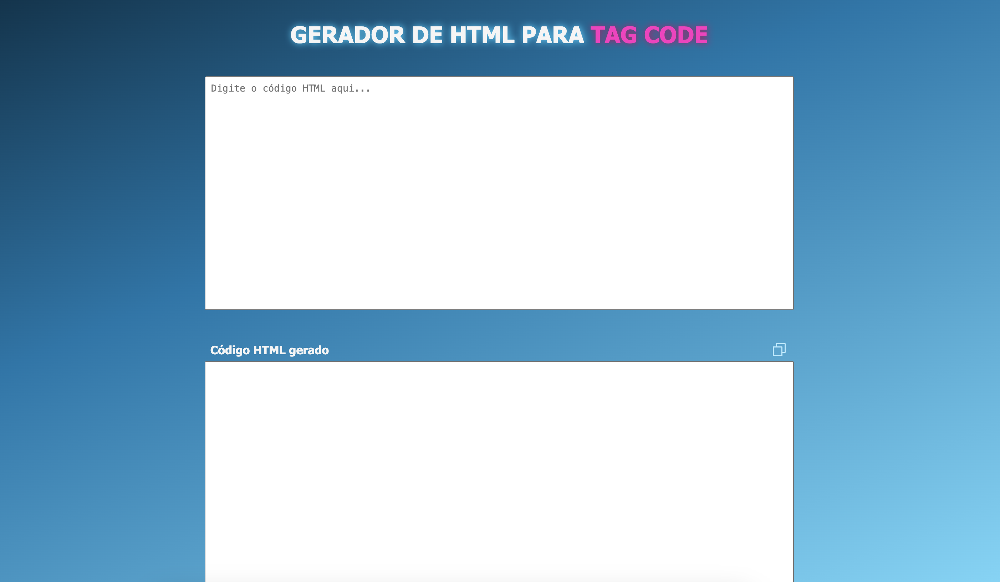

<p align="center">
  
</p>

<p align="center">
  <a href="LICENSE"></a>
</p>

## 💻 Projeto

A aplicação tem como objetivo criar um texto dentro de uma ***tag Code*** que represente o código HTML fornecido pelo usuário, garantindo que esse conteúdo seja exibido corretamente como texto em qualquer página HTML, em vez de ser interpretado como um código HTML.



<br><br>

### ⚡ Funcionalidades:
---

- Converter o código HTML passado pelo usuário em um texto adaptado para a tag Code pronto para ser utilizado em uma página HTML.

- Botão **Cópia para Área de Transferência** situado no lado direito do título "Código HTML gerado", permite a cópia rápida do resultado criado na conversão do código.

<!-- - Aplicação Responsiva -->
<br>

[ACESSE A APLICAÇÃO](https://darciocarvalho.github.io/Generate-HTML-to-Code-Tag/)


(Para abrir a aplicação em uma nova aba clique com a tecla <b>CRTL</b> no Windons ou Linux ou a tecla <b>COMMAND</b> no MacOS) 

<br>
<i style="display:inline-block;margin-top:-35px; font-size: 12px; color:#71717a">(Para abrir a aplicação em uma nova aba clique com a tecla <b>CRTL</b> no Windons ou Linux ou a tecla <b>COMMAND</b> no MacOS)</i>

## ✨ Tecnologia

- [Javascript](https://developer.mozilla.org/pt-BR/docs/Web/JavaScript)
- [HTML](https://developer.mozilla.org/pt-BR/docs/Web/HTML)
- [CSS](https://developer.mozilla.org/pt-BR/docs/Web/CSS)

## 🚀 Como executar

### 1. Clone o repositório:
```bash
git clone https://github.com/DarcioCarvalho/Generate-HTML-to-Code-Tag.git
```

### 2. Inicie o projeto
Abra o arquivo index.html no seu navegador preferido para iniciar a página web.


Isso é tudo!!! A partir de agora você pode acessar a aplicação e testar todas as funcionalidades mencionada.


## 📝 License

Esse projeto está sob a licença MIT. Veja o arquivo [LICENSE](LICENSE) para mais detalhes.

---

<p align="center">
  Desenvolvido com 🤩 by Dárcio Carvalho
</p>
